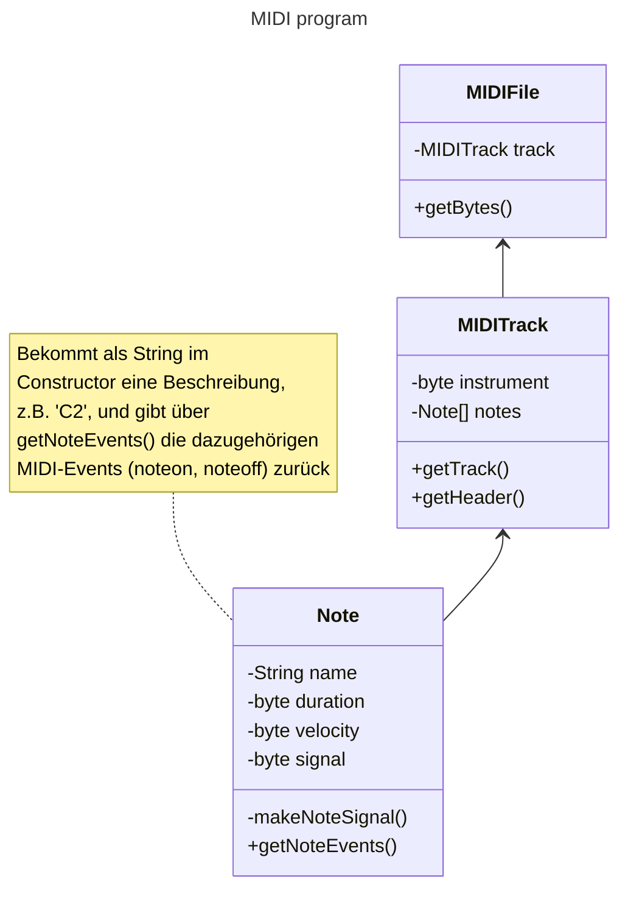

In dieser Woche schreiben Sie Ihren Code der letzten Woche objektorientiert um. Es bietet sich dabei die Verwendung des [Cheatsheets Objektorientierung](https://github.com/dabrowskiw/Programmierung1-Materialien/blob/master/Cheatsheets/Cheatsheet3_Objektorientierung.md) an.

Klassen erlauben es, im Code Dinge aus der realen Welt bzw. Konzepte zusammenzufassen. Eine Klasse stellt also etwas dar, mit dem sich das Programm befasst - sie verwaltet alle Informationen darüber und bietet die Funktionalität an, die konzeptionell zu diesem Etwas gehört.

Im Fall des MIDI-Programms kann man dies beispielsweise wie folgt in drei Klassen zerlegen:

* Eine Klasse MIDIFile, die sich um die Datei an sich kümmert: 
  * Den Header
  * Den Track (später eine Liste von Tracks)
  * die Repräsentation der MIDI-Datei wie sie auf der Festplatte sein sollte (später das Schreiben der MIDI-Datei auf die Festplatte)
* Eine Klasse MIDITrack, die einen Track darstellt - ein MIDIFile besteht ja aus Tracks. Der Track kümmert sich um:
  * Seinen Header
  * Seine Noten (also die eigentliche Melodie)
  * Die Darstellung dieser Daten als byte-Arrays, die von MIDIFile später verwendet werden, um die finale Datei zu schreiben
* Eine Klasse Note. Die darin enthaltenen Informationen könnten auch im MIDITrack stehen, aber konzeptionell ist die Note ausreichend wichtig und ein selbstständiges Konzept, dass es sich anbietet, ihr eine eigene Klasse zu widmen. Die Klasse Note kümmert sich um:
  * Das Verwalten ihrer Eigenschaften (Dauer, Lautstärke, Tonhöhe und -Name)
  * Das Generieren des passenden byte-Arrays, welches ihr MIDI-Signal darstellt

Man kann diese Zusammenhänge auch als Diagramm (sogenanntes UML-Diagramm) übersichtlicher als im Fließtext darstellen:

# Aufgabe 1

Zunächst wird, wie bereits in den letzten Wochen, eine Möglichkeit benötigt, zwei byte-Arrays miteinander zu verketten. Implementieren Sie dafür in der Klasse `MIDITools` eine Methode `joinByteArrays(byte[] array1, byte[] array2)`, die ein neues byte-Array zurückgibt. Dieses soll die Bytes aus array1 enthalten, gefolgt von den Bytes aus array2.

# Aufgabe 2

Nach dieser Vorbereitung wenden wir uns der Note zu (wir arbeiten "von unten nach oben", da wir ja für MIDITrack die Note benötigen, und für MIDIFile den MIDITrack).

Implementieren Sie zunächst in der Klasse `Note` einen Constructor
`public Note(String note, byte fullNoteDuration, byte velocity)`. Dieser soll geeignete `private`-Attribute der Klasse setzen. Sinnvoll wäre es, an dieser Stelle schon das MIDI-Signal (Siehe Aufgabe 1 aus Hausaufgabe 2) zu berechnen und dieses in einem Attribut der Klasse abzulegen.

Die Note wird als String übergeben. Dieser beschreibt die Note, die Oktave und die Dauer der Note nach dem Schema <Notenname><Oktave><sharp><Teiler der Note>. Dabei ist:
* Notenname: Ein Notenname aus (C, D, E, F, G, A, B), wie Sie das bereits aus der MIDI-Tontabelle kennen
* Oktave: Es wird zunächst für die Note die MIDI-Oktave 2 angenommen. Diese kann wie folgt geändert werden:
  * Jedes `'` hinter dem Notennamen erhöht die Oktave um 1
  * Jedes `,` hinter dem Notennamen verringert die Oktave um 1
* sharp: Optional kann hier ein `#` stehen, dann ist die Note sharp
* Teiler der Note: Die Dauer der Note entspricht der übergebenen `fullNoteDuration` geteilt durch diesen Wert.

Hier zum Verständnis noch ein paar Beispiele:

* `C''#4'`: Ein C in Oktave 4 (default=2, +2 für die zwei `'`), um einen Halbton erhöht (#), also das MIDI-Signal 61. Die Dauer beträgt `fullNoteDuration/4`
* `D,2`: Ein D in Oktave 1 (default=2, -1 für das `,`), also MIDI-Signal 26. Die Dauer beträgt `fullNoteDuration/2`
* `F1`: Ein F in Oktave 2 (default-Wert, ohne Veränderungen), also MIDI-Signal 41. Die Dauer beträgt `fullNoteDuration`

Implementieren Sie zudem eine Methode `getNoteEvents()`, die als byte-Array zwei MIDI-Events zurückgibt: Einen noteOn-Event (ohne Verzögerung) und einen passenden noteOff-Event (mit Verzögerung = Dauer der Note). Die velocity soll der im Constructor übergebenen velocity entsprechen.

# Aufgabe 2

Implementieren Sie eine Klasse `MIDITrack`, die einen Track aus mehreren Noten repräsentiert. Implementieren Sie hier zunächst einen Constructor `public MIDITrack(String[] notes, byte fullNoteDuration, byte defaultVelocity, byte instrument)`. Dieser soll intern ein Array von Notes (`private Note[] notes`) entsprechend der im ersten Argument übergebenen Notenbeschreibungen erstellen. Zudem soll das Instrument in einem geeigneten internen Attribut gespeichert werden.

Implementieren Sie zudem eine Methode `byte[] getTrack()`. Diese gibt den kompletten Track als byte-Array zurück: Header (beachten Sie hier für die Längenberechnung, dass pro Note 2 Events = 8 byte benötigt werden, und verwenden Sie das im Constructor übergebene Instrument), gefolgt von den Signalen der einzelnen Noten, gefolgt von den 3 Byte für "Ende des Tracks".

# Aufgabe 3

Implementieren Sie zuletzt die Klasse `MIDIFile` mit dem Constructor `MIDIFile(MIDITrack track, byte speed)`. Der Constructor braucht hier nur die übergebenen Argumente in geeigneten internen Attributen speichern.

Implementieren Sie zudem in der Klasse die Methode `byte[] getBytes()`. Diese soll den kompletten Inhalt der MIDI-Datei als byte-Array zurückgeben, also den Header (verwenden Sie hier für die Geschwindigkeitsangabe die im Constructor übergebene Geschwindigkeit) sowie die bytes des Tracks.

Ein Beispiel für die Verwendung der fertigen Klassen finden Sie in der Klasse `Main`. Können Sie erkennen, welche Melodie hier erstellt wird?

